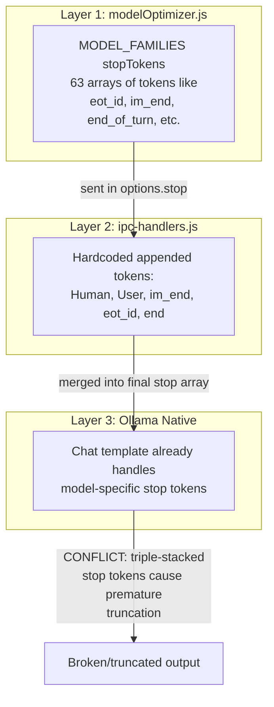
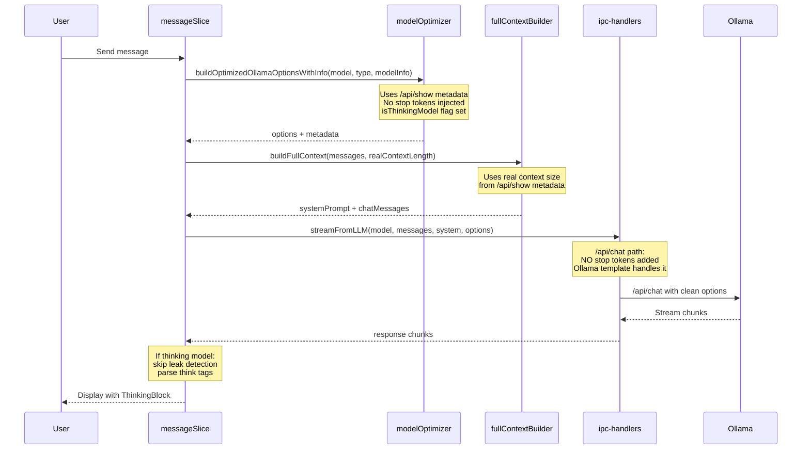

# Chat Pipeline Overhaul

## Root Cause Diagnosis

The chat system has **three layers of stop tokens fighting each other**, which is the primary reason models produce truncated, broken, or empty responses:

**Critical example**: DeepSeek-R1 has `</think>` in its stop tokens. This means the model's response gets killed the moment it finishes its thinking block -- before producing the actual answer.

With Ollama's `/api/chat` endpoint, the chat template **already applies the correct stop tokens** for each model. All manual stop tokens are redundant and harmful.

---

## Phase 1: Stop Token Surgery (Highest Impact)

The single most impactful change. Removes all conflicting stop tokens.

### [modelOptimizer.js](src/services/modelOptimizer.js)

- Remove the `stopTokens` property from **every entry** in `MODEL_FAMILIES` (60+ families)
- Remove `stop: [...familyProfile.stopTokens] `from `getOptimalSettings()` (line 550)
- Remove `stop: [...familyProfile.stopTokens] `from `buildOptimizedOllamaOptionsWithInfo()` (line 767)
- Remove `stop: []` from default settings objects
- Keep the `stop` key in the output but always set it to `[]` (empty) -- the IPC handler will handle the `/api/generate` fallback case

### [ipc-handlers.js](electron/ipc-handlers.js)

- In the `/api/chat` path (lines 829-831): **Remove ALL hardcoded stop tokens**. Ollama's chat template handles this natively.
- In the `/api/generate` path (lines 853-864): **Keep ONLY turn-leak prevention tokens**: `Human:`, `User:` (and their lowercase variants). Remove all template tokens (`<|im_end|>`, `<|eot_id|>`, `<|end|>`).
- Lower default `repeat_penalty` from `1.1` to `1.05`

---

## Phase 2: Thinking Model Support

Make reasoning models (DeepSeek-R1, QwQ, Gemma3 with thinking, etc.) work properly and show their reasoning.

### [modelOptimizer.js](src/services/modelOptimizer.js)

- Add an `isThinkingModel(family, modelName)` export that returns `true` for known reasoning models: `deepseek-r1`, `qwq`, and any model name containing `thinking` or `reason`
- Also check `/api/show` metadata: if the model's template contains `<think>`, it's a thinking model
- Add `_isThinkingModel` metadata flag to the options output

### [messageSlice.js](src/stores/slices/messageSlice.js)

- Import `isThinkingModel` and check it during `_generateResponse`
- For thinking models: skip `stripPromptLeak` and `detectPromptLeak` entirely (thinking content looks like meta-reasoning to these detectors)
- For thinking models: do NOT abort on early content that starts with reasoning patterns
- Store `isThinkingModel` in generation metadata so UI components can use it

### [ThinkingBlock.jsx](src/components/Chat/ThinkingBlock.jsx)

- Fix `getPartialThinking()` bug: use `content.lastIndexOf('<think')` on original content (not lowercase), or use case-insensitive indexOf properly
- Handle edge case: partial `</think` tag during streaming

### [EnhancedMessageBubble.jsx](src/components/Chat/EnhancedMessageBubble.jsx)

- When the model is a thinking model, always show the ThinkingBlock component (even before `<think>` tags appear, as an anticipatory "Thinking..." indicator)

---

## Phase 3: Universal Model Detection with Real Metadata

Use Ollama's `/api/show` metadata as the authoritative source instead of filename guessing.

### [fullContextBuilder.js](src/services/fullContextBuilder.js)

- Modify `buildFullContext()` signature to accept an optional `modelContextLength` parameter
- When provided, skip `getModelContextSize()` and use the passed-in value directly
- This leverages the real context length from `/api/show` that's already stored in `modelSlice.currentModelInfo`

### [messageSlice.js](src/stores/slices/messageSlice.js)

- Pass `currentModelInfo?.contextLength` to `buildFullContext()` when calling it
- This ensures the context builder uses the model's **real** context window, not a guess

### [modelSlice.js](src/stores/slices/modelSlice.js)

- Store the raw `/api/show` template string in `currentModelInfo` (needed for thinking model detection by template inspection)

### [ipc-handlers.js](electron/ipc-handlers.js)

- In `llm:modelInfo` handler: also return the model's `template` field from `/api/show` response (this contains the chat template, which reveals if a model uses `<think>` tags)

---

## Phase 4: Quality Defaults

Align default parameters with what LM Studio and other high-quality frontends use.

### [modelOptimizer.js](src/services/modelOptimizer.js)

- Lower default `repeat_penalty` from `1.15` to `1.05` (line 747)
- Lower the `gpt` catch-all `repeat_penalty` from `1.15` to `1.1`
- Lower the `Math.max()` floor in `buildOptimizedOllamaOptionsWithInfo` from `1.05` to `1.0` (some models like DeepSeek intentionally use `repeat_penalty: 1.0`)
- Ensure `creative` type families (nous, hermes, dolphin, etc.) have `repeat_penalty <= 1.1`

### [workspaceSlice.js](src/stores/slices/workspaceSlice.js)

- Simplify `RESPONSE_INSTRUCTION` -- the current version is fine for non-thinking models, but add a note that thinking models should NOT be subject to the "never think out loud" instruction

---

## Phase 5: Legacy Path Cleanup

Fix remaining features that still use the broken `/api/generate` endpoint.

### [debateStore.js](src/stores/debateStore.js)

- Refactor `_startNextTurn` to send `messages[]` array instead of `{ prompt, system }` -- this ensures the debate feature uses `/api/chat`

### [CompareMode.jsx](src/components/Chat/CompareMode.jsx)

- Refactor `runComparison` to send `messages[]` array instead of `{ prompt, system }`

### [ModelLibrary.jsx](src/components/Models/ModelLibrary.jsx)

- Refactor `handleBenchmark` to send `messages[]` array instead of `{ prompt, system }`

### [ai-handlers.js](electron/ipc/ai-handlers.js)

- Remove the dead `ipcMain.on('stream-llm')` handler (lines 126-206) -- it's never registered and only uses `/api/generate`

---

## Data Flow After Overhaul

