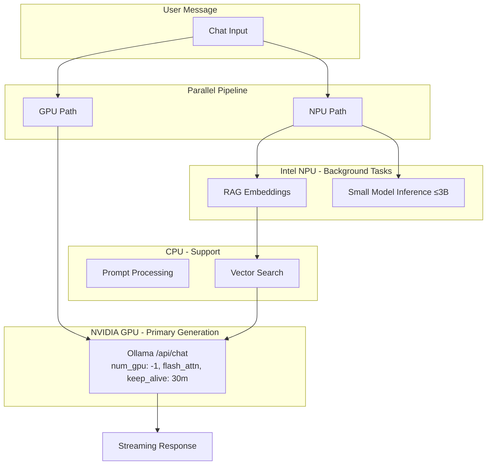

# Unified Hardware Acceleration -- GPU + NPU In Sync

## Current Reality (What's Broken)

After a deep investigation, here's what's actually happening today:

1. **GPU offloading is silently broken.** The auto-tuner returns `gpuLayers: 'all'` (a string), but `messageSlice.js` line 1200 checks `typeof gpuLayers === 'number'` -- this NEVER passes. So the GPU recommendation is silently discarded.
2. **GPU and NPU never work together.** The orchestrator picks ONE backend per request. If Ollama (GPU) is active, the NPU sits idle. If NPU is active, the GPU sits idle.
3. **CUDA env vars never reach Ollama.** Power mode sets `CUDA_VISIBLE_DEVICES`, `CUDA_CACHE_MAXSIZE`, etc. on the Electron process, but Ollama is spawned as a *separate process* via `spawn('ollama', ['serve'])` with no env vars passed. Ollama never sees them.
4. **No `keep_alive`.** After each request, Ollama may unload the model from GPU memory after its default 5-minute timeout. Every conversation can cold-start.
5. **Embeddings waste GPU.** RAG embeddings run through Ollama on the same GPU as generation, blocking it. The NPU can handle embeddings but is never asked to.

## Architecture: GPU + NPU Working In Sync

**The key insight:** GPU and NPU should handle *different tasks simultaneously*, not fight over the same task.

- **GPU**: All LLM generation (chat, code, agents) -- it's 10-50x faster than CPU
- **NPU**: Embeddings, RAG indexing, small model tasks -- frees GPU for generation
- **CPU**: Prompt tokenization, vector search, UI -- the glue that coordinates everything

## Changes

### Phase 1: Fix Critical GPU Bugs

**File: [src/stores/slices/messageSlice.js**](src/stores/slices/messageSlice.js) (line 1200)

- Fix the string-to-number translation for `gpuLayers`
- `'all'` -> `-1`, `'most'` -> `33`, `'partial'` -> `15`
- Default `num_gpu` to `-1` when any GPU detected (never send `null`)

**File: [electron/services/auto-tuner.js**](electron/services/auto-tuner.js) (line 156)

- Return numeric `gpuLayers` (-1 for full offload) instead of strings

### Phase 2: Keep Model Hot in GPU Memory

**File: [electron/ipc-handlers.js**](electron/ipc-handlers.js) (llm:stream, llm:send, llm:warmup)

- Add `keep_alive: "30m"` to every Ollama request payload
- This tells Ollama to keep the model in GPU VRAM for 30 minutes
- Fix warmup to use `/api/chat` (matches real inference path)

**File: [src/stores/slices/modelSlice.js**](src/stores/slices/modelSlice.js)

- Pass `keep_alive` in warmup so model stays loaded after preload

### Phase 3: Pass CUDA Env Vars to Ollama

**File: [electron/services/ollama-helper.js**](electron/services/ollama-helper.js)

- When spawning Ollama, pass CUDA and performance environment variables explicitly:
  - `OLLAMA_FLASH_ATTENTION=1` (server-wide flash attention)
  - `OLLAMA_KEEP_ALIVE=30m` (default keep-alive for all models)
  - `OLLAMA_NUM_PARALLEL=2` (allow 2 parallel requests)
  - `CUDA_VISIBLE_DEVICES=0` (ensure correct GPU)
  - `OLLAMA_HOST=0.0.0.0:11434` (listen on configured port)

### Phase 4: Route Embeddings to NPU (GPU + NPU In Sync)

**File: [electron/services/embedding-service.js**](electron/services/embedding-service.js)

- Add a new `embedTextsWithNPU()` function that routes embedding requests to the OpenVINO NPU endpoint (`http://localhost:8081`)
- Modify the main `embedTexts()` function to try NPU first for embeddings, fall back to Ollama
- This means: while GPU generates a chat response, NPU simultaneously processes RAG embeddings

**File: [electron/services/rag-service.js**](electron/services/rag-service.js)

- Update to use the new NPU-aware embedding path
- Add logging: "Embeddings routed to NPU (GPU free for generation)"

### Phase 5: Parallel Job Queue in Orchestrator

**File: [electron/services/inference-orchestrator.js**](electron/services/inference-orchestrator.js)

- Allow the job queue to process GPU and NPU jobs in parallel (not serial)
- A GPU generation job should NOT block a NPU embedding job
- Add task type awareness: `generation` tasks -> GPU, `embedding` tasks -> NPU

### Phase 6: Performance Verification and Logging

**File: [electron/ipc-handlers.js**](electron/ipc-handlers.js)

- After each generation, log `eval_count / eval_duration` from Ollama response = tokens/second
- Log whether model is GPU-accelerated or CPU-only
- Send this info to frontend so user can see actual performance

**File: [src/components/Settings/SettingsModal.jsx**](src/components/Settings/SettingsModal.jsx)

- After warmup, query Ollama's `/api/ps` to confirm model is on GPU
- Display: model name, VRAM usage, layers on GPU, tokens/sec from last generation
- Show NPU status alongside: "NPU handling embeddings" when active

### Phase 7: Power Mode Integration

**File: [electron/services/power-mode.js**](electron/services/power-mode.js)

- Move CUDA env var setup to happen BEFORE Ollama starts (or restart Ollama with env vars)
- Add Windows power plan detection: warn user if not on "High Performance"
- Set Ollama and OpenVINO server processes to HIGH priority together

## What This Achieves

**Before (independent, broken):**

- GPU offload silently fails (string bug)
- Model unloads from GPU between messages
- NPU sits idle during chat
- Embeddings block the GPU
- CUDA optimizations never reach Ollama

**After (synchronized, tuned):**

- GPU handles ALL generation layers (`num_gpu: -1`) with flash attention
- Model stays in GPU VRAM for 30 minutes (`keep_alive`)
- NPU handles embeddings and small model tasks in parallel
- CUDA env vars properly passed to Ollama at startup
- Performance logging proves GPU acceleration is working
- UI shows real VRAM usage and tokens/second

## Files Changed (10 files)

- `src/stores/slices/messageSlice.js` -- Fix gpuLayers string bug, default num_gpu to -1
- `electron/services/auto-tuner.js` -- Return numeric gpuLayers
- `electron/ipc-handlers.js` -- Add keep_alive, fix warmup, add perf logging
- `electron/services/ollama-helper.js` -- Pass CUDA + Ollama env vars to spawn
- `src/stores/slices/modelSlice.js` -- Pass keep_alive in warmup
- `electron/services/embedding-service.js` -- NPU embedding path
- `electron/services/rag-service.js` -- Use NPU-aware embeddings
- `electron/services/inference-orchestrator.js` -- Parallel GPU+NPU job queue
- `electron/services/power-mode.js` -- Move CUDA setup before Ollama spawn
- `src/components/Settings/SettingsModal.jsx` -- Verified GPU status display

